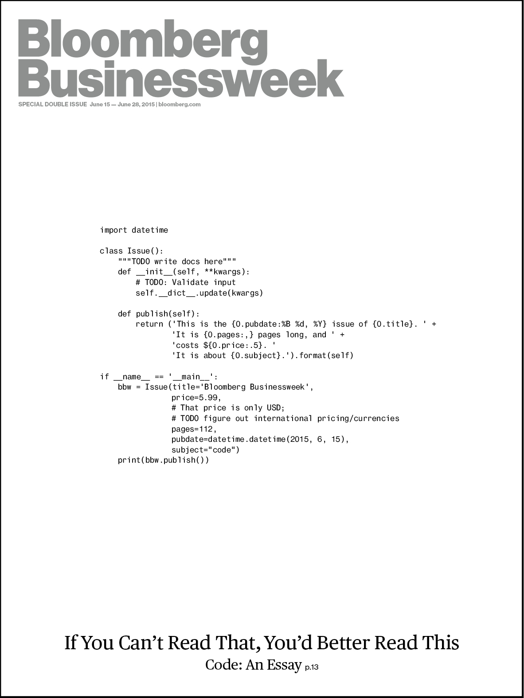
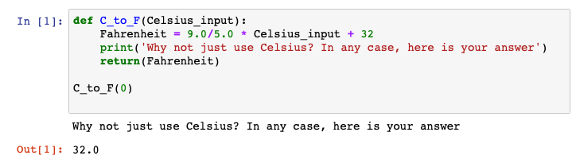

# Module 1: The `coding mindset` and intro to `python` as a language

# Course overview
In this course, you will learn to:
**1. Formulate and execute a strategic plan for earth-resource data analysis**
**2. Import, wrangle, and analyze earth-resource data using python syntax, data types, data storage, and pandas**
**3. Design and implement methods for statistical analysis of earth-resource data**
**4. Visualize earth-resource data**
**5. Implement machine-learning models for earth-resource data**

After working to develop these learning outcomes, I found this [article](https://medium.com/@dataoptimal9/5-data-science-projects-that-will-get-you-hired-in-2018-9e51525084e) that lists five skills that will get you a job in data science. Read that article and think about how similar the two lists are, and which topic of either list you are most excited about.

## Assessments
- video intro and follow-up discussion
- reflection on readings discussion
- concept map and peer review
- syntax notebook
- colab notebook for Titanic

## Let's get to know each other!
Please use this discussion to introduce yourself to the class. Tell us a little about yourself by posting a 1-2 minute video to this discussion board. In your video, address the following points:

- Name
- Role and/or specialty (e.g., sedimentologist, operations geologist)
- Company or University, and how long you have been there
- What you most want to be able to accomplish after finishing this course that you cannot do now (i.e., why are you here?!)
- Something interesting about yourself - hobbies, family, etc.

Once you have posted your own video, respond to the videos of at least two of your peers. Your response should welcome your colleague and respond to one or more of the points that they raise in their video, noting what you found of interest or what you would like to learn more about from them. You can respond using text, or a video. Please double-check the [Discussion Board Guidelines](https://elearning.mines.edu/courses/27785/pages/discussion-board-guidelines) for tips on how to respond to your peers.

# Module overview
This was the cover of a 2015 Bloomberg Business Week [article](https://github.com/bloombergmedia/whatiscode) about code:

So, can you read it? It is written in python - can you tell what it is trying to do?

---

Here is a simpler example (also in python):

It does the following:

1. defines a function to convert temperature units called `C_to_F`
1. Does the math to convert Celsius to Fahrenheit
1. Asks why you would ever want to convert from Celsius (the standard SI unit)
1. Returns the value `Celsius_input` as the value `Fahrenheit`.

The last line `C_to_F(0)` calls the function with Celsius input `0` and returns the Fahrenheit value `32`.

---

You may ask yourself *Isn't it just easier to do this in Excel?* Honestly, sometimes the answer is yes. But, if you have to do the same task over and over, doing it manually in Excel can get pretty tedious. Furthermore, there are just some things that very difficult or impossible to do in Excel that languages like `python` are optimized for (e.g., vector math like adding 3.14 to a big column of values). In Excel, that requires creating a new column of values, and dragging an equation (`=A1+3.14`) all the way down the list of values. In python, if that list of values is called x, you just type `x+3.14` and python does the work for you.

If you find yourself limited by Excel, `python` will allow you to:
- be more efficient by automating tasks that are mundane and boring, but that you have to do over and over.
- make fewer errors (Excel files are notorious for having cell-reference errors)
- analyze and visualize data in ways impossible for Excel

Python also has the added bonus of being open-source (i.e., free!), with TONS of specialized packages, customization, and support via discussion boards like [stackoverflow](https://stackoverflow.com/questions/32409802/basic-explanation-of-python-functions) available. The whole idea behind python is to share code and knowledge with others, so that we all build up the ecosystem together. That doesn't mean you can't have proprietary code that's just for you (or your company), but if you find yourself needing a function to do something, and you think *someone must have already made this!*, then someone probably has! Searching open-source code repositories like [GitHub](https://github.com/) can be amazingly useful, saving you literal weeks of time of recreating the wheel.

## It's a language! ¡Es una lengua! 这是一种语言!
Learning to code is very similar to learning a new language - there is vocabulary, rules on how to structure 'sentences' and conjugate verbs - it can be difficult and frustrating, but also very rewarding! This first module will help you learn to 'think like a programmer' and design a strategy for a project before you begin coding. Then, you will put this knowledge into practice, by building your first data-science project!

After successful completion of the module, learners will be able to **formulate and execute a strategic plan for earth-resource data analysis**, including:
- Discuss and debate resources for critical thinking about coding, help on errors, etc.
- Design a concept map for a dataset using the discussion and readings as a guide
- Hack together your first python code!

# The coding mindset

## Data is everywhere, right?
We keep hearing about it - petabytes of data are created every day and we need AI to solve all of our problems - just dump the data into a machine-learning model, and insights come out the other side. Of course, it is not quite that easy, as data is usually (1) not available, or (2) messy and needs significant cleaning/wrangling/munging. Earth-science data is especially messy, as much of it is analog (e.g., scanned paper copies of well logs) or has been collected over many years with different methods (again, well logs are a great example). The last reading puts in perspective the amount of time that data scientists spend cleaning data vs. deploying fancy machine-learning models.

### Read
The readings below focus on the 'why', as in "why should you learn data science?" instead of just using Excel to curate and analyze data?

- [Why not just use Excel? Because almost all spreadsheets are full of errors](https://www.forbes.com/sites/salesforce/2014/09/13/sorry-spreadsheet-errors/#32d3148856ab)
  - Here is a [link](https://arxiv.org/pdf/1009.2785.pdf) to the actual article where Excel files were analyzed for errors
- [Why geoscientists should care about data creation and curation](https://www.nature.com/articles/d41586-020-01366-w)
- What takes up most of a data scientist's time? [2017 CrowdFlower report](https://visit.figure-eight.com/rs/416-ZBE-142/images/CrowdFlower_DataScienceReport.pdf)
  - also see this [blog post about cleaning data](https://blog.ldodds.com/2020/01/31/do-data-scientists-spend-80-of-their-time-cleaning-data-turns-out-no/)

### Take note
Questions to ask yourself while reading:

- Have you ever found an error in a spreadsheet? How big of a deal was it?
- How much time do you usually spend organizing data vs. analyzing it?
- How important is domain knowledge (i.e., earth science expertise) in cleaning and curating data?
- Can you think of an interesting earth-science dataset that is already curated and cleaned? What about one that is interesting, but super messy and/or incomplete?

## Design thinking and domain knowledge
The following texts focus on 'design thinking', a method for framing a problem or project before you jump in and start doing the work. Design thinking is otherwise known as critical-thinking, but perhaps in a more thoughtful, reflective way. This does not happen often in earth science, as much of our work is still about discovery, rather than the formulaic hypothesis + experiment = result. For example, when you gather data from a new outcrop or a new seismic volume, do you know what you are going to find?

Instead of just exploring, we can design a project from the beginning to test hypotheses rather than just exploring. Design thinking is reflecting on what may be value-adding problems to solve, and then collecting data to answer that question. With existing datasets, too often the mindset is "here is some data, let's machine-learn it". Rather, design thinking encourages you to step back and think about the 'why' before just jumping in to see what's in the data.

Importantly, you need domain knowledge to know what questions to ask and what hypotheses to pose!

### Read

#### Design thinking
- [definition](https://en.wikipedia.org/wiki/Design_thinking)
- [overview](https://faculty.ai/blog/powering-data-science-with-design-thinking/)
- Design thinking for data science
  - [Part 1](https://www.linkedin.com/pulse/design-thinking-mindset-data-scientist-part-1-michael-taylor/)
  - [Part 2](https://www.linkedin.com/pulse/design-thinking-mindset-data-scientist-part-2-michael-taylor/)
- [data-driven organizations](https://www.infoq.com/articles/data-science-organization-framework/)

#### Importance of domain knowledge for design thinking
- [The oil and gas perspective](https://www.linkedin.com/pulse/role-domain-knowledge-data-science-patrick-bangert/)
- 
Supplemental readings:
- [Who's side are you on?](https://www.dataversity.net/data-science-vs-domain-expertise-who-can-best-deliver-solutions/)
  - nice quote "The Domain Expert’s greatest strength is the ability to identify which questions need to be answered, and the Data Scientists role is to maneuver and leverage advanced data technologies to build expert systems to answer those questions."
- ["It is simply not possible to do useful data science without sufficient domain knowledge."](https://towardsdatascience.com/minimum-viable-domain-knowledge-in-data-science-5be7bc99eca9)
- [A healthcare perspective on domain knowledge](https://data-science-blog.com/blog/2017/11/10/the-importance-of-domain-knowledge-a-healthcare-data-science-perspective/)

### Take note
Questions to ask yourself while reading:

- How can you avoid coming up with the right answer for the wrong question?
- How would you have implemented design thinking into a project you have previously worked on?
- What do you think is the appropriate mixture of data science skills and domain knowledge?
- If a dataset is labeled/categorized, how reliable/uncertain are those labels? Would two different earth scientists categorize data in the same way, with the same labels?

## Assignment: Reflection on readings discussion
In the assigned readings, you have learned about the importance of data, design thinking, and domain knowledge in data-science projects. Revisit the "Take note" sections, and choose three questions to answer - each answer should be no more than three sentences. Please use the attached rubric to help guide your writing.

After everyone has submitted their reflection, reply to at least two of your colleagues, responding to one or more of the points that they made that resonated with you, or you would like to know more about.

---

## Assignment: Concept map creation
Now comes the time to consider a dataset and create a concept map of how you would go about cleaning and exploring it. Consider what you have learned about integrating domain knowledge into a design thinking framework, and how that might inform your data analysis plan-of-attack.

- Take a look at the [*Titanic* dataset](https://www.openml.org/d/40945) using Google Sheets (don't worry, we will use python later to more efficiently do this type of data exploration!)
- Use your 'domain knowledge' about the Titanic and socioeconomics to consider who had the best chance for survival. If you need to gather some domain knowledge, go [here][(https://web.stanford.edu/class/archive/cs/cs109/cs109.1166/problem12.html).
- Sketch out (using pen and paper) a concept map of the path you would take through data analysis. Consider the following:
  - Which parts of the data are already clean, and which are messy and need cleaning?
  - What is a possible hypothesis that you would like to test with this dataset?
  - How would you go about testing that hypothesis (creating plots, statistical regressions, etc.)?

Take a photo of the sketch, and upload the image. Pro tip: The mobile Canvas app allows you to upload photos taken by your phone.

**Congrats, you just wrote your first program!**

# Syntax and data structures in `python`
Zane notes:
- BUILD NOTEBOOK FROM Chapter 3 of Wes McKinney
- 0 not 1
- array, int, float, str, boolean
- list, dict, tuple, ndarray
- indexing and slicing, stacking
- operators (e.g., +, -, \*, /, ==, !=, <, <=)
- loops
  - for i in x,for x in range(), ;
- help using tab completion and `?`, example `'len?`
- creating simple functions `def`

THOMAS STUFF GOES HERE

THOMAS STUFF GOES HERE

THOMAS STUFF GOES HERE

THOMAS STUFF GOES HERE

THOMAS STUFF GOES HERE

THOMAS STUFF GOES HERE

THOMAS STUFF GOES HERE

THOMAS STUFF GOES HERE

THOMAS STUFF GOES HERE

THOMAS STUFF GOES HERE

THOMAS STUFF GOES HERE

THOMAS STUFF GOES HERE

# Analyze your first dataset in python!

## Introduction to Colab
In the pre-work, you should have had an introduction to Colab - if not, watch the following video to learn a bit about Colab [Colab introduction](https://youtu.be/inN8seMm7UI)

## Your first python notebook
Using [this scaffolded Colab notebook](UPDATE LATER WITH TITANIC DATA), follow along to import the provided dataset and perform some data cleaning, visualization, and summary statistical analysis.

Upload your notebook as a ipynb.
